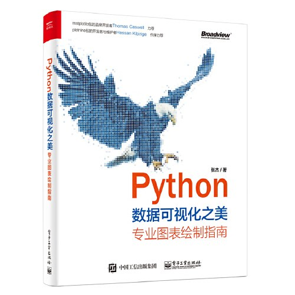

# 《python数据可视化之美》配套代码

《Python数据可视化之美》中相关代码的整理修正，并补充包含运行结果的对应Notebook文件、Markdown文件、opml文件（可导入到workflowy、幕布等大纲笔记软件）。

> 本书主要介绍如何使用python中的matplotlib、seaborn、plotnine、basemap等包绘制专业图表。本书先介绍了python语言编程基础知识，以及使用numpy和pandas两个包的数据操作方法；再对比了matplotlib、seaborn和plotnine三个包的图形语法。本书系统性地介绍了使用matplotlib、seaborn和plotnine绘制类别对比型、数据关系型、时间序列型、整体局部型、地理空间型等常见的二维和三维图表的绘制方法。另外，本书也介绍了商业图表与学术图表的规范与差异，以及如何使用matplotlib包绘制HTML交互页面动画。
>
> 本书所用python版本为：3.7.1；图表绘制包matplotlib、seaborn、plotnine、geoplot和geopandas的版本分别为：3.0.2、0.9.0、0.5.1、0.3.2和0.4.1；数据处理包numpy和pandas的版本分别为：1.15.4和0.23.4。
>
> python作为免费的开源软件，数据分析与可视化的包更新迭代很快，这是它的优势。但是有时候有些代码运行可能会由于python及其包版本的更新，而出现函数弃用（deprecated）的情况。此时，需要自己更新代码，使用新的函数替代原有的函数。

